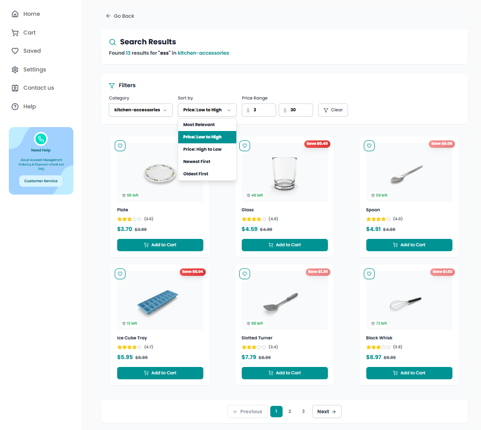
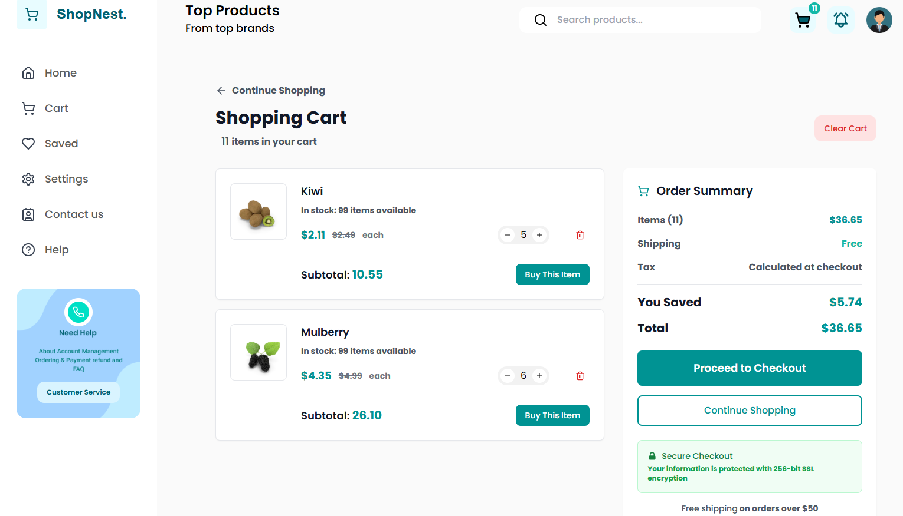
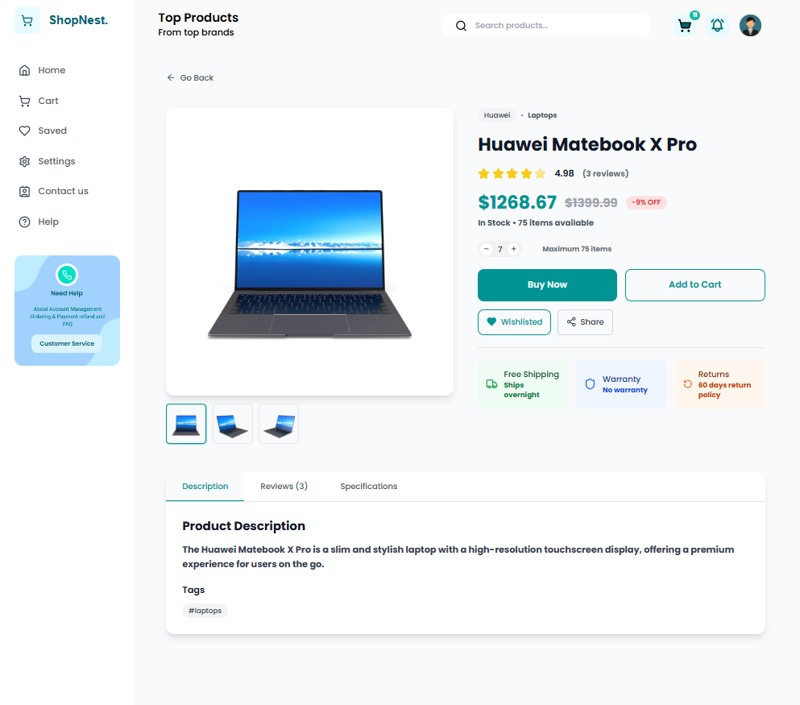
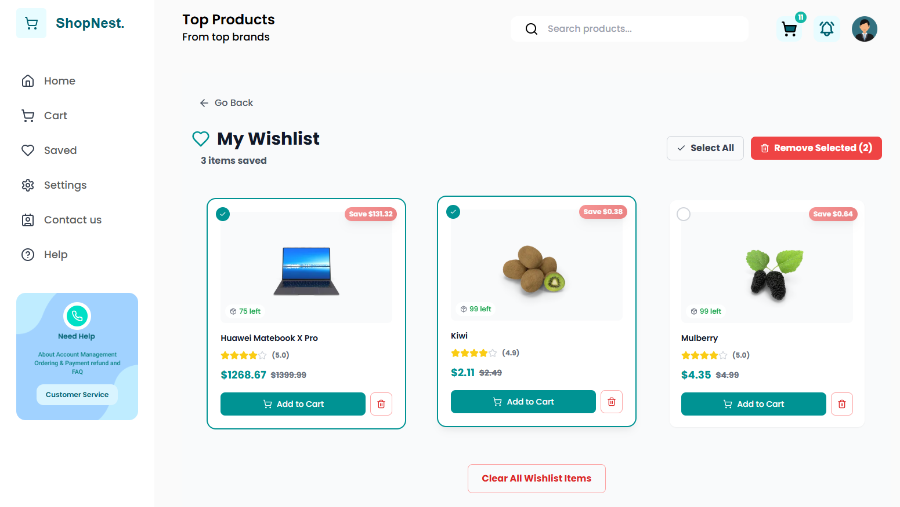
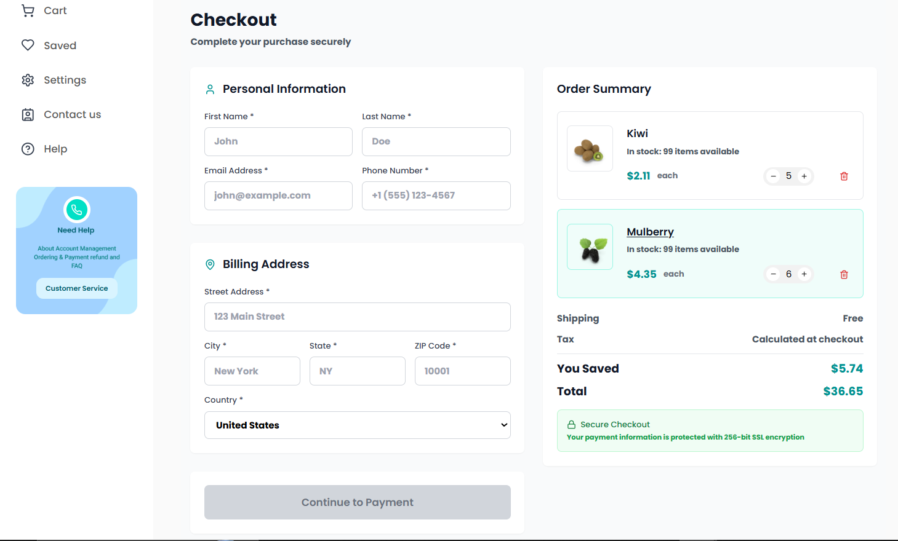

# 🛍️ ShopNest — E-Commerce Platform

ShopNest is a modern e-commerce web application built with React, TypeScript, Tailwind CSS, and the DummyJson API, covering the complete shopping workflow from product discovery to checkout.  
The project focuses on clean component architecture, state management, and responsive UI patterns commonly used in production frontend applications.

[](https://ecommerce-shopnest-with-react.netlify.app/)
[](https://github.com/OussamaDjebbour/Ecommerce)

 <!-- Add a screenshot here -->

## ✨ Features

### 🛒 Shopping Experience

- **Product Catalog**: Browse 30+ products across 9+ categories
- **Advanced Filtering**: Filter by category, price range, with 5 sorting options
- **Smart Pagination**: Efficient loading for large product catalogs
- **Wishlist**: Save favorite products for later

### 💳 Cart Management

- **Persistent Cart**: Shopping cart synced with localStorage
- **Real-time Updates**: Instant cart updates with optimistic UI
- **Stock Alerts**: Notifications when products reach stock limits
- **Multi-step Checkout**: Smooth checkout flow with form validation

### 🎨 User Experience

- **Responsive Design**: Optimized for mobile (320px) to desktop (1920px+)
- **Loading States**: Lazy/Skeleton loading for better perceived performance
- **Toast Notifications**: Real-time feedback for user actions (add, update, delete)
- **Modern UI**: Clean interface with Tailwind CSS

### ⚡ Performance

- **Code Splitting**: Lazy loading for optimal bundle size
- **API Caching**: TanStack Query reduces redundant requests
- **Optimized Rendering**: Efficient state management with Zustand

## 🛠️ Tech Stack

**Frontend Framework**

- React 18
- TypeScript
- Tailwind CSS

**State Management**

- Zustand (global state)
- TanStack Query (server state)
- LocalStorage (persistence)

**Form & Validation**

- React Hook Form

**UI & UX**

- React-Toastify (notifications)
- Lucide-React (icons)
- Skeleton screens

**API & Data**

- DummyJSON API
- Axios (HTTP client)
- RESTful API integration

**Dev Tools**

- Vite (build tool)
- ESLint + Prettier
- TypeScript strict mode

## 🚀 Getting Started

### Prerequisites

- Node.js 18+ and npm/pnpm/yarn

### Installation

1. Clone the repository

```bash
git clone https://github.com/OussamaDjebbour/Ecommerce.git
cd Ecommerce
```

2. Install dependencies

```bash
npm install
# or
pnpm install
# or
yarn install
```

3. Start the development server

```bash
npm run dev
```

4. Open [http://localhost:5173](http://localhost:5173) in your browser

### Build for Production

```bash
npm run build
```

## 📁 Project Structure

```
src/
├── components/          # Reusable UI components
│   ├── ui/             # Base and reusable UI components
│   ├── features/           # Cart-related components
├── pages/              # Page components
├── hooks/              # Custom React hooks
├── store/              # Zustand store configuration
├── services/           # API services
├── types/              # TypeScript type definitions
├── helpers/              # Utility(Helper) functions
└── App.tsx             # Root component
```

## 🎯 Key Features Explained

### Smart Filtering System

- **Multi-criteria**: Combine categories, price ranges, and sorting
- **URL State**: Shareable filtered results via URL parameters
- **Debounced Search**: Optimized search with 300ms debounce

### State Management Strategy

- **Zustand**: Cart and wishlist global state
- **TanStack Query**: API data fetching and caching
- **LocalStorage**: Persist cart across sessions

### Performance Optimizations

- Lazy loading routes and heavy components
- Image optimization with lazy loading
- TanStack Query minimizes redundant API requests through caching and request deduplication
- Code splitting for smaller initial bundle

## 🔮 Future Enhancements

- [ ] User authentication
- [ ] Payment gateway integration (Stripe)
- [ ] Order history
- [ ] Product reviews and ratings
- [ ] Advanced search with autocomplete
- [ ] Dark mode
- [ ] Backend API (Node.js + MongoDB)

## 📸 Screenshots

### Homepage


### Product Filtering



### Shopping Cart



### product details



### wishlist



### Checkout



## 🤝 Contributing

Contributions are welcome! Please feel free to submit a Pull Request.

## 📝 License

This project is open source and available under the [MIT License](LICENSE).

## 👤 Author

**Oussama Djebbour**

- Portfolio: [my-personal-portfolio-ts.netlify.app](https://my-personal-portfolio-ts.netlify.app/)
- GitHub: [@OussamaDjebbour](https://github.com/OussamaDjebbour)
- LinkedIn: [Oussama Djebbour](https://www.linkedin.com/in/oussama-djebbour-87251827a/)

## 🙏 Acknowledgments

- [DummyJSON](https://dummyjson.com/) for the product API
- [Lucide](https://lucide.dev/) for beautiful icons
- [Tailwind CSS](https://tailwindcss.com/) for styling

---

⭐ If you found this project helpful, please give it a star!
